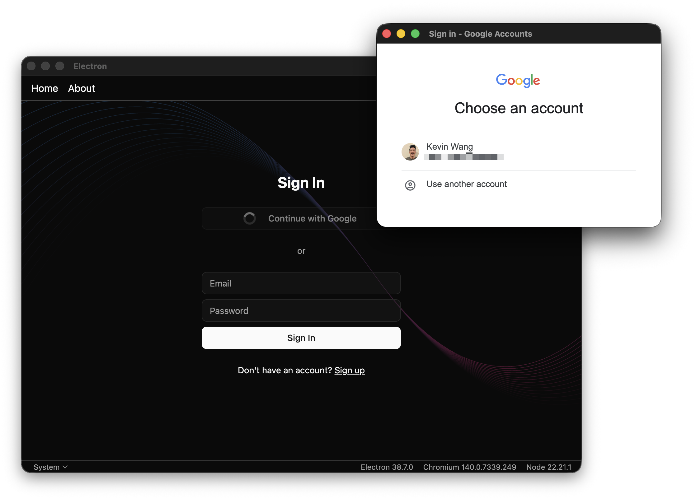

This is an example project of myself exploring integrating Clerk in an Electron app.

The high-level approach consists of:

- Enable the native API for Clerk
- Make Clerk behave like the `@clerk/clerk-expo` SDK
  - "proxy" requests to Clerk through the electron "main" process (using IPC)
    so that the app behaves like a mobile app.
- This implements a [custom flow](https://clerk.com/docs/guides/development/custom-flows/overview), which is tightly integrated with the underlying Clerk Application's auth settings.
- The OAuth flow is handled by opening an external browser window to complete the flow.
  - Additional steps may be required to handle production OAuth credentials.

This should work for the following conditions:
1. Development PK + Development electron
1. Production PK + Development electron
1. Development PK + Production electron
1. Production PK + Production electron


Other notes:
- use Tailwind, for web-like styling
- use file-system based routing so the project can scale



## Quick start

Set your PK in `.env`.

```console
npm i
npm run dev
```

```console
npm run build:mac
# could take up to 5 minutes

open ./dist/mac-arm64/clerk-electron.app

# or open with app protocol
open myapp://
```
